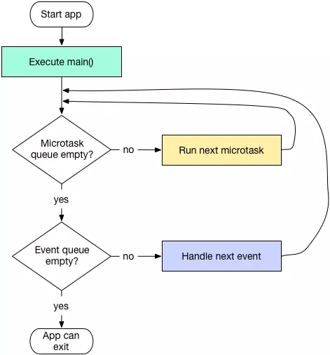

Isolate的理解
-----
### 1、Isolate
```
Dart是基于单线程模型的语言。在Dart中有一个很重要的概念叫isolate,
我们用Dart写的应用都是运行在main isolate中的
```
### 2、event loop
```
event loop不停的从队列中获取消息或者事件来驱动整个应用的运行;
它有两个队列，一个叫做event queue，另一个叫做microtask queue
```
##### 原理图

```
1、启动app。

2、首先执行main方法。

3、在main方法执行完后，开始处理microtask queue，从中取出microtask执行，直到microtask queue为空。
   这里可以看到event loop在运行时是优先处理microtask queue的。
   
4、当microtask queue为空才会开始处理event queue，如果event queue不为空则从中取出一个event执行。
   这里要注意的是event queue并不会一直遍历完，而是一次取出一个event执行，
   执行完后就回到前面去重新判断microtask queue是否为空。
   所以这里可以看到microtask queue存在的一个重要意义是由它的运行时机决定的，
   当我们想要在处理当前的event之后，并且在处理下一个event之前做一些事情，或者我们想要在处理所有event之前做一些事情，
   这时候可以将这些事情放到microtask queue中。
   
5、当microtask queue和event queue都为空时，app可以正常退出。
```
```
Note:
当event loop在处理microtask queue时，会阻塞住event queue。
绘制和交互等任务是作为event存放在event queue中的，所以当microtask queue中任务太多或处理时长太长，
将会导致应用的绘制和交互等行为被卡住。

Future是Dart中提供的一个类，构造一个Future就会向event queue中添加一条记录
```
### 3、使用scheduleMicrotask向microtask queue添加任务
```
async.scheduleMicrotask(() => microtask());

void microtask(){
  //  doing something
}
```
